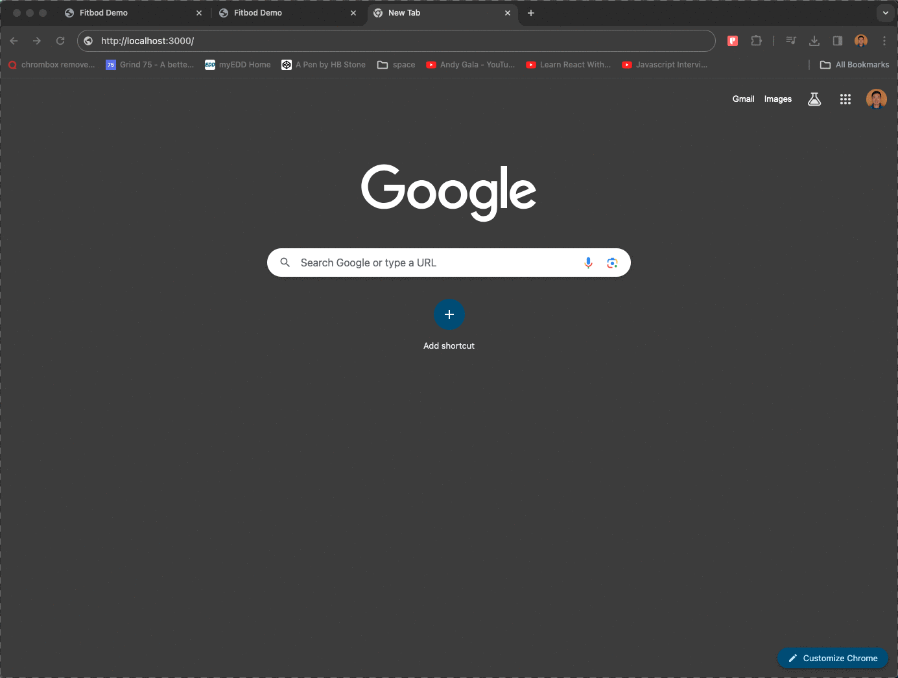

# Fitbod Demo - Thomas Toan
## Project Setup
1. Install dependencies:
```
npm install
```

2. Start the project:
```
npm start
```

3. Open [http://localhost:3000](http://localhost:3000) with your browser to see the result.

Other useful commands: 
`npm run dev`, `npm run test`, `npm run build`

## About the Project

#### Technologies in the project: 
 - React
 - TypeScript
 - Next.js
 - Tailwind CSS
 - Jest
 - React Testing Library

#### Navigation
- Next.js App Router

### Index Page
- Built as a server component
- Uses Next.js fetch API to retrieve exercise list
- Data is passed from the index page to the relevant exercise page using a link and query parameters

### Exercise Page
- built as a client component
- localStorage
  - each exercise stores data based on an exercise key in localstorage
  - e.g. "fitbod-landmine-press"
  - e.g. "fitbod-dumbbell-fly"
- input validation
- error handling
- responsive design for smaller mobile viewports


Mock of performance history JSON saved to localStorage :
```
[
  {
      "id": "03/22/2024",
      "data": [
          {
              "id": "1d7d2a68-f2d8-4c52-9bca-24974e8a4159",
              "time": "2024-03-22T15:17:30.852Z",
              "reps": 18,
              "weight": 12,
              "exerciseId": "landmine-press",
              "estimated1RM": 23
          },
          {
              "id": "793f613e-00be-4871-a540-20467fdfa488",
              "time": "2024-03-22T15:14:38.964Z",
              "reps": 12,
              "weight": 12,
              "exerciseId": "landmine-press",
              "estimated1RM": 17
          }
      ]
  },
  {
      "id": "03/20/2024",
      "data": [
          {
              "id": "edee3002-926a-4dea-b032-5851bbfa796c",
              "time": "2024-03-20T19:14:49.534Z",
              "reps": 10,
              "weight": 10,
              "exerciseId": "landmine-press",
              "estimated1RM": 13
          }
      ]
  }
]
```

## Testing
To run tests: 
```
npm run test
```


## Demo

#### index and exercise pages


#### form validation and error handling


## Questions for the Design Team
In the scenario where I'm collaborating with the designer/design team, these are clarifying questions I would have in order to ensure we build for responsiveness but stick to the spirit of the Figma designs:

1. The exercise page “+” button has an 1px black border on the desktop design, but not the mobile design. Is this intentional? If yes, we can conditionally make the border appear for only desktop.

2. For the exercise page movile view, are we able to shrink the 32px space between the “weight” input and the “+” button?
  - We maintain the 32px space when the viewport allows for it (e.g. wider mobile views and desktop views)
  - For very small mobile viewport widths, we allow the space between the weight input field and the add button to shrink
  - For especially small mobile viewport widths, we stack the input label on top of the input field in order to keep all input fields and the “+” button on one horizontal line (use Chrome dev tools to get a better visual)

Chrome Dev Tools: iPhone SE:


Chrome Dev Tools: Samsung Galaxy S8+ 


## Additional Notes

### Known quirks/bugs

- focus-visible modifier in tailwind behaves a bit weird
	- Browser dev tools mobile view displays a red ring around the input fields when they are focused
  - Tailwind displays a blue inner ring for input fields with the focus-visible modifier. This ring can be removed, but additional project dependencies would need to be installed.

### Other enhancements
Given additional time, these are some of the ways the project could be improved:

- Add messaging on the exercise page when no performance history exists
  - A simple "no performances found" or "add performances using the form above" message can be conditionally displayed when no performance history is found.

- More robust input validation
  - no negative numbers, cap the maximum number a user can input
  - these changes will ensure realistic Estimated 1RM calculations
  - These limitations will also ensure proper display and alignment of the PerformanceHistoryItem values.

- Filter the order of the performance history
  - We are currently reliant on the fact that new performances will always be placed before/above existing performances. If we were to allow users to add performances with a backdate, or if we had somehow retrieved data that was out of order, we would want to ensure the proper order of the displayed performances by adding an actual filter to the data

- More robust testing
  - Most of the project's unit tests focus on rendering. Given more time, I would write more tests that focus on component behavior in response to user interaction (e.g. when a user add values to the Reps or Weight inputs)
  - I tried to mock the API for testing, but it seems Mock Service Worker doesn't mesh well with the latest version of Next.js. Similarly, I tried to mock the test environment's url, but wasn't happy with the current workarounds for testing the useParams hook in Next.js 14. Given more time, I would dig into these issues deeper to get a better mechanism for testing the index and exercise pages.

- Accessibility
  - More thoroughly test with a screen reader for labels and actions
  - I've added aria-labels to interactive elements, but nothing tests for accessibility better than an actual screen reader.